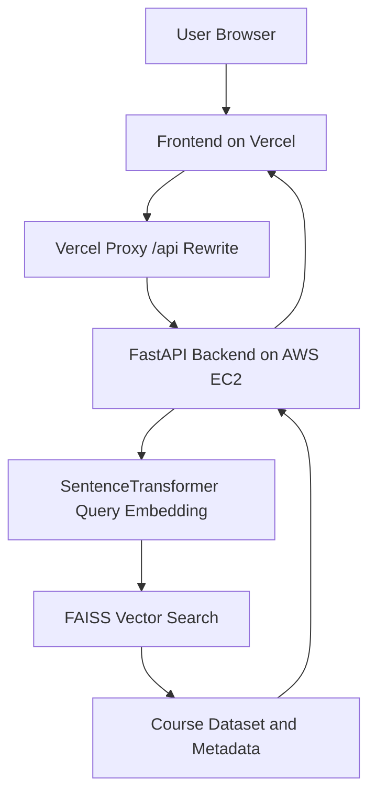

# LearnWise - AI Course Recommendation System

[](https://www.python.org/)
[](https://fastapi.tiangolo.com/)
[](https://github.com/facebookresearch/faiss)
[](https://react.dev/)
[](https://tailwindcss.com/)
[](https://vercel.com/)
[](https://aws.amazon.com/ec2/)

## 1. Project Title

**LearnWise - AI Course Recommendation System**

LearnWise is an AI-powered course recommendation platform that helps users discover relevant online courses from natural language search queries. The system supports multilingual inputs and returns relevant recommendations using semantic embeddings and FAISS vector similarity search.

## 2. Live Demo

- Frontend: [https://www.learn-wise.me](https://www.learn-wise.me)
- Backend API: [http://api.learn-wise.me](http://api.learn-wise.me:8000)

## 3. Features

- Semantic course search using natural language queries
- Multilingual query support with SentenceTransformer embeddings
- High-performance vector similarity retrieval with FAISS
- FastAPI backend for recommendation serving
- Modern React + Tailwind frontend UI
- Real-time recommendations
- Health check endpoint for monitoring
- Production deployment with custom domain setup

## 4. Tech Stack

### Frontend

- React (Vite)
- Tailwind CSS
- Fetch API
- Vercel (hosting + CDN)

### Backend

- Python
- FastAPI
- Uvicorn
- Sentence Transformers
- FAISS
- Pandas
- Scikit-learn

### Machine Learning

- SentenceTransformer embedding model
- Semantic search pipeline
- Vector similarity retrieval
- Precomputed embedding index

### Data

- 87,000+ online courses
- Sources include:
	- Coursera
	- Udemy
	- Other curated course datasets

The dataset is cleaned and transformed before embedding generation and FAISS indexing.

## 5. Architecture



## 6. Machine Learning Pipeline


### Pipeline Steps

1. **Data Cleaning**  
	 Course records from multiple sources are cleaned and normalized.

2. **Feature Preparation**  
	 Course titles and descriptions are processed into model-ready text.

3. **Embedding Generation**  
	 SentenceTransformer creates dense vector embeddings for all courses.

4. **Index Creation**  
	 Embeddings are indexed in FAISS for fast nearest-neighbor search.

5. **Query Processing**  
	 User query -> query embedding -> FAISS search -> top matching courses.

## 7. API Endpoints

### `GET /health`

Returns API health status.

**Example response:**

```json
{
	"status": "ok"
}
```

### `GET /recommend?query=<query>&top_k=5`

Returns top recommended courses based on semantic similarity.

**Example request:**

```bash
curl "https://api.learn-wise.me/recommend?query=machine%20learning%20for%20beginners&top_k=5"
```

**Example response:**

```json
{
	"courses": [
		{
			"title": "Introduction to Machine Learning",
			"platform": "Coursera",
			"url": "https://example.com/course/intro-ml",
			"score": 0.912
		},
		{
			"title": "Machine Learning A-Z",
			"platform": "Udemy",
			"url": "https://example.com/course/ml-a-z",
			"score": 0.899
		}
	]
}
```

## 8. Deployment

### Production Setup

- **Frontend:** Vercel CDN (`learn-wise.me`)
- **Backend:** AWS EC2 (`api.learn-wise.me`)
- **Recommendation Engine:** FastAPI + FAISS + SentenceTransformer

### Runtime

FastAPI is served with Uvicorn and managed in production with PM2.

```bash
uvicorn main:app --host 0.0.0.0 --port 8000
```

### Domain and Proxy

- Frontend domain: `learn-wise.me`
- Backend subdomain: `api.learn-wise.me`
- Vercel rewrites are used as a temporary API proxy to avoid HTTPS/HTTP mixed-content issues.

## 9. Installation Guide

### 1) Clone Repository

```bash
git clone https://github.com/Vedrockerz/Course-Recommendation-System.git
cd Course-Recommendation-System
```

### 2) Backend Setup

```bash
cd backend
python -m venv .venv
# Windows
.venv\Scripts\activate
# macOS/Linux
source .venv/bin/activate

pip install -r requirements.txt
uvicorn main:app --reload --host 0.0.0.0 --port 8000
```

Backend runs at `http://localhost:8000`.

### 3) Frontend Setup

```bash
cd frontend
npm install
npm run dev
```

Frontend runs at `http://localhost:3000` (or the port shown by your frontend dev server).

### 4) Quick API Check

```bash
curl "http://localhost:8000/health"
curl "http://localhost:8000/recommend?query=python%20data%20science&top_k=5"
```

## Project Structure

```text
Course-Recommendation-System/
|- frontend/                 # React + Vite UI
|- backend/                  # FastAPI backend server
|  |- src/                   # Recommendation logic and FAISS search
|  |- data/                  # Datasets, FAISS index, artifacts
|- notebooks/                # Data cleaning and model experiments
|- deploy/                   # Deployment configs (EC2, service, nginx)
```

## 10. Future Improvements

- YouTube course integration
- User preference learning
- Personalized recommendations
- Hybrid recommendation system
- Course popularity ranking
- Caching layer for frequent queries

## 11. Author

**Ved Shivhare**  
AI/ML Engineer
