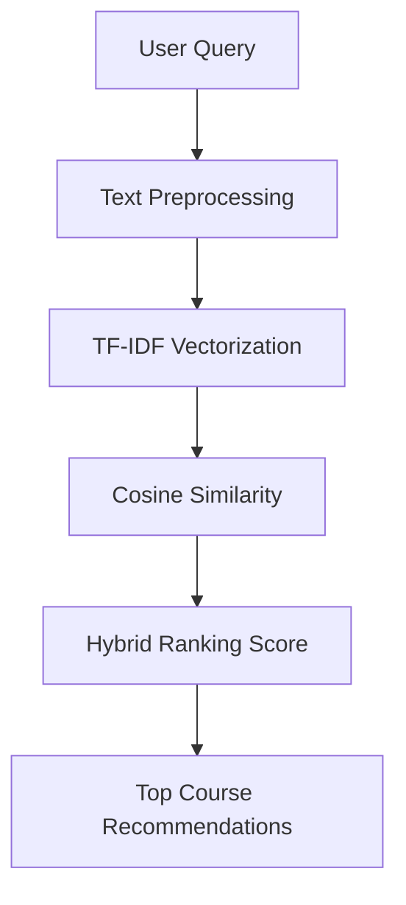

# 🎓 LearnWise - AI Course Recommendation System


An **end-to-end Machine Learning system** that recommends the best online courses from **Udemy and Coursera** based on a user's learning query.

The system uses **TF-IDF, cosine similarity, and hybrid ranking** to return relevant and high-quality courses.

---

## 🚀 Live Demo
👉 **[Open the App](https://learnwise.streamlit.app)**

---

## 📷 App Preview

### 🔎 Search Interface


### 🎯 Course Recommendations


---

## ✨ Features

- 🔎 Semantic course search using **TF-IDF**
- 📊 **Hybrid ranking** (relevance + course quality)
- 🎯 Filters:
  - Course level
  - Minimum duration
  - Maximum duration
- 📚 Courses from **Udemy & Coursera**
- ⚙️ Modular **ML pipeline architecture**
- 🎨 Interactive **Streamlit frontend**

---

## 🔄 Project WorkFlow

---
## 📂 Project Structure
``` bash
course-recommendation-system
│
├── data
│ ├── raw
│ ├── processed
│ └── artifacts
│
├── src
│ ├── data
│ ├── features
│ ├── recommender
│ ├── pipelines
│ └── utils
│
├── app
│ └── streamlit_app.py
│
├── config.py
├── constants.py
├── requirements.txt
└── README.md
```

---

## ⚙️ Installation

1. **Clone the repository:**
```bash
git clone https://github.com/Vedrockerz/Course-Recommendation-System.git
cd course-recommendation-system
```
2. **Set up Virtual Environment:**
```bash
python -m venv venv
# Windows:
venv\Scripts\activate
# Mac/Linux:
source venv/bin/activate
```
3. **Install Dependencies**
```bash
pip install -r requirements.txt
```
---

## 🏃 Running the Project
**1️⃣ Run training pipeline**
```bash
from src.pipelines.training_pipeline import TrainingPipeline
pipeline = TrainingPipeline()
pipeline.run_pipeline()
```
This creates model artifacts in:
```bash
data/artifacts/
```
**2️⃣ Run frontend**
```bash
streamlit run app/streamlit_app.py
```
---

## 📊 Dataset

**The dataset was created by cleaning and merging public datasets from Udemy and Coursera, containing:**
- Course Title
- Platform
- Description
- Level
- Duration
- Rating
- Review Count

---

## 🛠 Tech Stack

- **Python**
- **Scikit-learn**
- **TF-IDF Vectorization**
- **Cosine Similarity**
- **Pandas & NumPy**
- **Streamlit**
- **Matplotlib / Seaborn**

---
## 🚧 Phase 2 (Planned)
**Future improvements:**
- Real-time course data
- YouTube course integration
- Course thumbnails and links
- Price filtering
- AI learning roadmap generation

---


## 👨‍💻 Author

**Ved Shivhare**\
Machine Learning & AI enthusiast building systems that help people learn better.

⭐ If you like this project, consider starring the repository.
