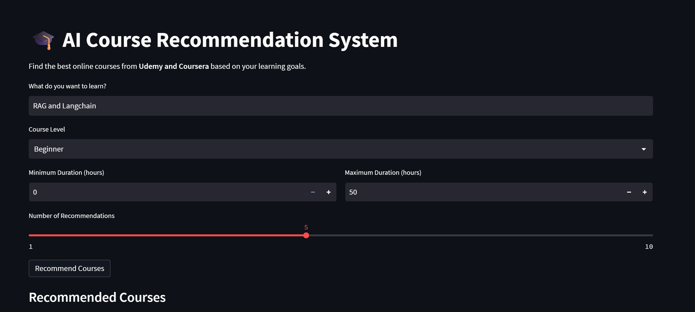
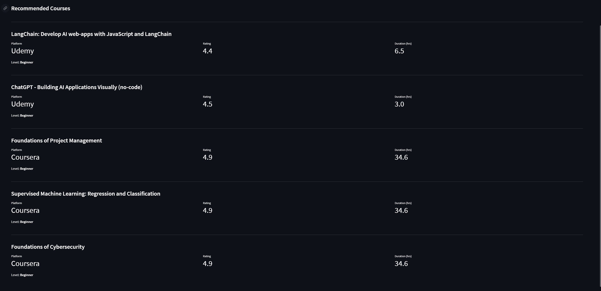
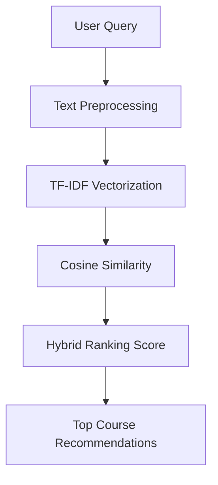

# 🎓 LearnWise - AI Course Recommendation System


An **end-to-end Machine Learning system** that recommends the best online courses from **Udemy and Coursera** based on a user's learning query.

The system uses **TF-IDF, cosine similarity, and hybrid ranking** to return relevant and high-quality courses.

---

## 🚀 Live Demo
👉 **[Open the App](https://learnwise.streamlit.app)**

---

## 📷 App Preview

### 🔎 Search Interface


### 🎯 Course Recommendations


---

## ✨ Features

- 🔎 Semantic course search using **TF-IDF**
- 📊 **Hybrid ranking** (relevance + course quality)
- 🎯 Filters:
  - Course level
  - Minimum duration
  - Maximum duration
- 📚 Courses from **Udemy & Coursera**
- ⚙️ Modular **ML pipeline architecture**
- 🎨 Interactive **Streamlit frontend**

---

## 🔄 Project WorkFlow

---
## 📂 Project Structure
```bash
Course-Recommendation-System/
├── backend/
│   ├── app/
│   ├── data/
│   ├── src/
│   ├── tests/
│   ├── requirements.txt
│   └── README.md
└── frontend/   # to be added separately
```

---

## ⚙️ Installation

1. **Clone the repository:**
```bash
git clone https://github.com/Vedrockerz/Course-Recommendation-System.git
cd Course-Recommendation-System
cd backend
```
2. **Set up Virtual Environment:**
```bash
python -m venv venv
# Windows:
venv\Scripts\activate
# Mac/Linux:
source venv/bin/activate
```
3. **Install Dependencies**
```bash
pip install -r requirements.txt
```
---

## 🏃 Running the Project
If you are at repository root, move into backend first:
```bash
cd backend
```

**1️⃣ Run training pipeline**
```bash
from src.pipelines.training_pipeline import TrainingPipeline
pipeline = TrainingPipeline()
pipeline.run_pipeline()
```
This creates model artifacts in:
```bash
data/artifacts/
```

**2️⃣ Run FastAPI backend**
Create a local environment file first:
```bash
cp .env.example .env
```
Set `YOUTUBE_API_KEY` in `.env` if you want live YouTube resources.

```bash
uvicorn main:app --reload
```

**3️⃣ Run tests**
```bash
pytest
```
---

## 📊 Dataset

**The dataset was created by cleaning and merging public datasets from Udemy and Coursera, containing:**
- Course Title
- Platform
- Description
- Level
- Duration
- Rating
- Review Count

---

## 🛠 Tech Stack

- **Python**
- **Scikit-learn**
- **TF-IDF Vectorization**
- **Cosine Similarity**
- **Pandas & NumPy**
- **Streamlit**
- **Matplotlib / Seaborn**

---
## 🚧 Phase 2 (Planned)
**Future improvements:**
- Real-time course data
- YouTube course integration
- Course thumbnails and links
- Price filtering
- AI learning roadmap generation

---


## 👨‍💻 Author

**Ved Shivhare**\
Machine Learning & AI enthusiast building systems that help people learn better.

⭐ If you like this project, consider starring the repository.

---

## Render Deployment

1. Use backend folder as the service root.
2. Install dependencies:
```bash
pip install -r requirements.txt
```
3. Recommended build command (preloads the same SentenceTransformer model during build):
```bash
pip install -r requirements.txt && python -c "from sentence_transformers import SentenceTransformer; SentenceTransformer('sentence-transformers/paraphrase-multilingual-MiniLM-L12-v2')"
```
4. Optional environment variables:
```bash
HF_HOME=/opt/render/project/.cache/huggingface
TOKENIZERS_PARALLELISM=false
YOUTUBE_API_KEY=your_youtube_api_key_here
YOUTUBE_MAX_RESULTS=6
YOUTUBE_TIMEOUT_SECONDS=8
```
5. Start command:
```bash
uvicorn main:app --host 0.0.0.0 --port 10000
```
6. Health check path:
```bash
/health
```

This repository also includes a `Procfile` with the same production start command.

## AWS EC2 Deployment (Backend)

### 1) Launch and prepare Ubuntu instance
```bash
sudo apt update
sudo apt install -y python3.11 python3.11-venv python3-pip git nginx
```

### 2) Clone and install backend
```bash
cd /home/ubuntu
git clone https://github.com/Vedrockerz/Course-Recommendation-System.git
cd Course-Recommendation-System/backend
python3.11 -m venv .venv
source .venv/bin/activate
pip install --upgrade pip
pip install -r requirements.txt
```

### 3) Create environment file
Create `/etc/learnwise-backend.env`:
```bash
PORT=8000
ALLOWED_HOSTS=your-domain.com,api.your-domain.com,localhost,127.0.0.1
CORS_ALLOW_ORIGINS=https://your-frontend-domain.com,http://localhost:3000
CORS_ALLOW_CREDENTIALS=false
HF_HOME=/home/ubuntu/.cache/huggingface
TOKENIZERS_PARALLELISM=false
```

### 4) Add systemd service (Gunicorn + Uvicorn worker)
Copy `deploy/ec2/learnwise-backend.service` to `/etc/systemd/system/learnwise-backend.service` and update paths if needed.

Then run:
```bash
sudo systemctl daemon-reload
sudo systemctl enable learnwise-backend
sudo systemctl start learnwise-backend
sudo systemctl status learnwise-backend
```

### 5) Configure Nginx reverse proxy
Copy `deploy/ec2/learnwise-backend.nginx.conf` to `/etc/nginx/sites-available/learnwise-backend` and update `server_name`.

Enable site:
```bash
sudo ln -s /etc/nginx/sites-available/learnwise-backend /etc/nginx/sites-enabled/
sudo nginx -t
sudo systemctl restart nginx
```

### 6) Open EC2 security group ports
- `22` for SSH
- `80` for HTTP
- `443` for HTTPS (recommended)

### 7) Optional HTTPS with Certbot
```bash
sudo apt install -y certbot python3-certbot-nginx
sudo certbot --nginx -d api.your-domain.com
```

### 8) Verify
```bash
curl http://127.0.0.1:8000/health
curl https://api.your-domain.com/health
```
